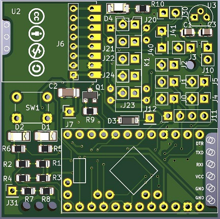
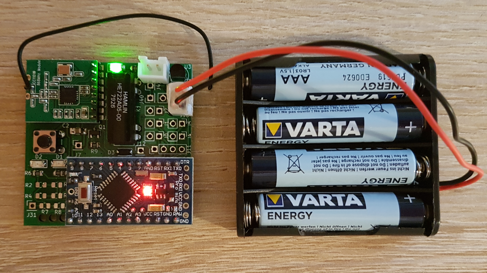

Dieses Werk ist lizenziert unter einer [Creative Commons Namensnennung - Nicht-kommerziell - Weitergabe unter gleichen Bedingungen 4.0 International Lizenz](http://creativecommons.org/licenses/by-nc-sa/4.0/).

# AskSin_Uni_PCB

Kompakte, universale Platine für Asksin-Projekte [Asksin-Projekte](https://asksinpp.de/)

[Schaltplan](AskSin_Uni_PCB.pdf)

### Was kann die Platine?
- Abmessungen ca. 45x45mm
- Platz für Arduino und Funkmodul
- Config Button
- 2 Status LEDs
- 1x Pinleiste für I²C
- Alle freien I/O Pins sind auf Lötaugen geroutet
- Zusätzliche Durchkontaktierungen beim Funkmodul, damit man mit dem ISP auch später noch dran kommt
- Optionaler 5V Spannungsregler(z.B. für das optionale Reed-Relais)
- Optionales 5V Reed-Relais mit Freilaufdiode und mit optionaler Status-LED
- Optionaler SMD-Spannungsteiler für HB-UNI-Sen-CAP-MOIST (R1, R2)
- Optionaler SMD-Spannungsteiler für HB-UNI-Sen-DIST-US (R3, R4)
- Optionaler SMD-Spannungsteiler für HB-UNI-Sen-PRESS (R7, R8)
- Die Versorungsspannung wird auf J10 angeschlossen (Pin 1 = Vcc (3..10V); Pin 2 = GND)

### Benötigte Bauteile
#### Minimalbestückung:
- 1x (U1) - ATmega328P und 3,3V / 8Mhz
- 1x (U2) - Funkmodul CC1101 868Mhz
- 1x (J6) - 8pol. Stiftleiste, gerade, RM 2,00
- 1x (D1) - SMD-LED rot (1206)
- 1x (R5) - SMD-Widerstand 1kOhm (0805)
- 1x (C2) - SMD-Kondensator 10µF (0805)
- 1x (SW)1 - Kurzhubtaster 6x6mm

D2 (2. LED) und R6 sind optinal falls der Sketch das unterstützt. Werte siehe D1 und R5.

#### Für die Verwendung als HB-UNI-Sen-CAP-MOIST zusätzlich zur Minimalbestückung:
- 1x (R1) - SMD-Widerstand 470kOhm (0805)
- 1x (R2) - SMD-Widerstand 100kOhm (0805)

Die Platine passt in das Gehäuse von "tonischabloni" auf Thingiverse
[Gehäuse HB-UNI-Sen-CAP-MOIST](https://www.thingiverse.com/thing:3633804)

#### Für die Verwendung als HB-UNI-Sen-DIST-US zusätzlich zur Minimalbestückung:
- 1x (R3) - SMD-Widerstand 470kOhm (0805)
- 1x (R4) - SMD-Widerstand 100kOhm (0805)

#### Für die Verwendung als HB-UNI-Sen-PRESS zusätzlich zur Minimalbestückung:
- 1x (R7) - SMD-Widerstand 80kOhm (0805) (oder optinal 2x 160kOhm übereinander gelötet)
- 1x (R8) - SMD-Widerstand 220kOhm (0805)

#### Für die Verwendung als 1-fach Schaltaktor zusätzlich zur Minimalbestückung (Versorgungsspannung größer/gleich 5VDC):
- 1x (R10) - SMD-Widerstand 1kOhm (0805) - optinal
- 1x (LED1) - SMD-LED grün (1206) - optinal
- 1x (R9) - SMD-Widerstand 1kOhm (0805)
- 1x (D4) - SMD-Diode (SOD-123) - z.B. 1N 4148
- 1x (Q1) - SMD-Transistor BC847 (SOT-23)
- 1x (K1) Reed-Relais 5V - ACHTUNG! Keines mit eingebauter Freilaufdiode verwenden!
- 1x (U3) - 5V Festspannungsregler µA 78L05 (TO-92)
- 2x (C1,C3) - SMD-Kondensator 10µF (0805)

### Generelle Hinweise:
Achtung: kein Verpolungs- oder Überspannungschutz vorhanden
