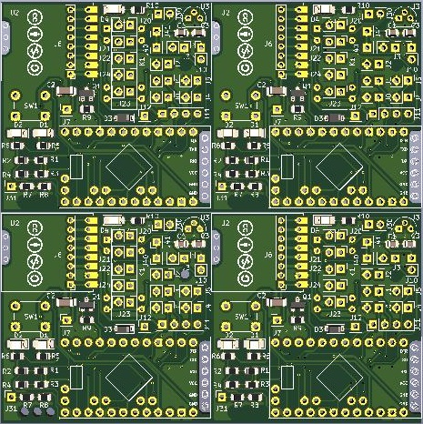

Dieses Werk ist lizenziert unter einer [Creative Commons Namensnennung - Nicht-kommerziell - Weitergabe unter gleichen Bedingungen 4.0 International Lizenz](http://creativecommons.org/licenses/by-nc-sa/4.0/).

# AskSin_Uni_PCB

Kompakte, universale Platine für [Asksin-Projekte](https://asksinpp.de/)

[Schaltplan](AskSin_Uni_PCB.pdf) 
 
### Gerber-Daten:
[Gerber-Daten mit 4 Platinen](/Gerber/) 

----------------------------------------------------------------------------------------

### Was kann die Platine?
- Abmessungen ca. 45x45mm
- Platz für Arduino und Funkmodul
- Config Button (Kurzhubtaster 6x6 mm; Bei der Verwendung des Universalgehäuses Höhe = 13 mm)
- 2 Status LEDs
- 1x Pinleiste für I²C (J11)
- Alle freien I/O Pins sind auf Lötaugen geroutet
- Zusätzliche Durchkontaktierungen beim Funkmodul, damit man mit dem ISP auch später noch dran kommt
- Optionaler 5V Spannungsregler(z.B. für das optionale Reed-Relais)
- Optionales 5V Reed-Relais mit Freilaufdiode und mit optionaler Status-LED
- Optionaler SMD-Spannungsteiler für HB-UNI-Sen-CAP-MOIST (R1, R2)
- Optionaler SMD-Spannungsteiler für HB-UNI-Sen-DIST-US (R3, R4)
- Optionaler SMD-Spannungsteiler für HB-UNI-Sen-PRESS (R7, R8)
- Die Versorungsspannung wird auf J10 angeschlossen (Pin 1 = Vcc (3..10V); Pin 2 = GND)

----------------------------------------------------------------------------------------

### Bestückvarianten:
Auf der Universalplatine sind bereits Bestückoptionen für folgende Projekte vorgesehen:
1. Minimalbestückung für universellen Einsatz
2. HB-UNI-Sen-CAP-MOIST
3. HB-UNI-Sen-DIST-US
4. HB-UNI-Sen-PRESS
5. 1-fach Batterieaktor HM LC SW1 BA PCB

----------------------------------------------------------------------------------------

### Wiki
Nähere Informationen zum Aufbau und Beispiele sind im [Wiki](https://github.com/pafra-123/AskSin_Uni_PCB/wiki) zu finden.

----------------------------------------------------------------------------------------

### Generelle Hinweise:
Achtung: kein Verpolungs- oder Überspannungschutz vorhanden
